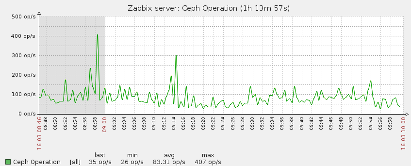
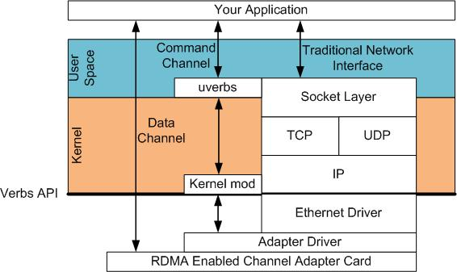

\newpage

Überblick
=========

Für mein Praxissemester war ich im Lehrpool/Rechenzentrum der Universität
Freiburg tätig. Während meiner Zeit dort war ich zuständig für die Wartung und
weiterentwicklung dreier Openstack Installationen.

Die erste war die Studicloud, diese wird in Zusammenarbeit mit der Hochschule
Furtwangen University benutzt.  Die zweite Installation ist eine Installation
namens BwCloud, die ein ähnliches Ziel wie die Studicloud besitzt aber über ganz
Baden-Württemberg verteilt ist, in diesem Fall waren wir für den Standpunkt
Freiburg zuständig. Die dritte Installation war die interne Installation,
genannt RzCloud.

Ich habe dieses Praxissemester zusammen mit Manuel Johannes Messner gemacht da
wir beide angenommen wurden durch unsere vorhergehenden Erfahrungen bezueglich
Openstack. Wir hatten oft die Aufgaben gemeinsam bekommen, und auch
abgearbeitet. Wir wurden auf die Universität Freiburg aufmerksam da wir beide
durch die Studicloud, im Rahmen unserer Arbeit als HiWi, dort Kontakte hatten.


Openstack
=========

Unser Praxissemester drehte sich hauptsächlich um Openstack. Openstack ist eine
Gruppe an Software Packeten um eine Server Cloud zu betreiben. Dieses besteht aus
mehreren unabhängigen Teilen die jeweils einen Teil machen; zum Beispiel Nova
für die Steuerung der Virtuellen Maschinen, oder Neutron für virtuelles Netze.

Während meiner Zeit habe ich mit allen, von Openstack bereitgestellten, _Core_
Packeten zusammengearbeitet:

- Keystone, Steuerung der Nutzer und Gruppen
- Nova, Bereitstellung und Steuerung Virtueller Maschinen
- Neutron, Vernetzung sowie Steurung dieser Netze
- Glance, Speicher der Virtuellen Abbilder
- Horizon, Dashboard für eine einfache Verwaltung

Es gibt noch weitere Module, da ich aber mit diesen nur wenig Kontakt hatte
wurden diese ausgelassen.

Entwickelt wird dieses Projekt seit 2010 unter anderem von der NASA
mitentwickelt.


Studicloud
----------

Die Studicloud ist eine Openstack Installation betrieben in Furtwangen. Dort
können sich Studenten aus Freiburg, Offenburg, sowie Furtwangen, Virtuelle
Server (auch VPS genannt) erstellen und verwalten. Jeder Student kann dann im
Rahmen seiner verfügbaren Ressourcen so viele Server starten wie er möchte/kann.

Die Installation ist seit September 2015 im Betrieb. Wir waren demnach von
Anfang an dabei und haben auch Aktiv die Weiterentwicklung gesteuert.


Die Cloud ist auf 5 Servern aufgebaut, 2 Management Knoten und 3 Compute
Knoten.

- Auf den Management Knoten liegen jeweils das Dashboard, Keystone sowie Neutron
- Auf den Compute Knoten gibt es auf jedem Nova sowie Virtuelle Router (durch
  Neutron gesteuert)


RzCloud
-------

Die RzCloud ist eine Test-Installation und wurde von uns auch so benutzt. Dort
konnten wir ungestört Infrastruktur testen, sowie verschiedene Wartungsabläufe
*üben* bevor wir diese dann Produktiv angesetzt haben. Sie hat einen ähnlichen
Aufbau wie die Studicloud.

BwCloud
-------

Die BwCloud ist komplexer aufgebaut wie die vorher gennanten da diese verteilt
ist. Sie besteht aus mehreren Zonen, verteilt durch Baden-Wuerttemberg.

Es gibt Standorte in Freiburg, Ulm, Mannheim sowie in Karlsruhe. Ich habe mich
während meines Praxissemesters nur mit dem Standort Freiburg auseinandergesetzt.

Der interne Aufbau ist der selbe wie in der Studicloud[\ref{studicloud}].


High Performance Computing
==========================

Freiburg besitzt auch einen HPC Cluster der viel in der Wissenschaft benutzt
wird; zum Beispiel für Simulationen.

Wir hatten nicht sehr viel mit diesem Cluster zu tun, durften uns aber ansehen
wie ein solcher Cluster aufgebaut ist, was sehr interessant und lehrreich war.


Erster Monat
============

Am Anfang wurden uns zwei Aufgaben gegeben:

- Monitoring für die Studicloud
- Auto Update von VPS Bildern


Monitoring
----------

Nach evaluation verschiedener Monitoring Software hatten wir uns für Zabbix
entschieden. Es ist darauf ausgelegt von mehreren Servern gleichzeitig Daten zu
sammeln, diese zu aggregieren und auszuwerten.


### Zabbix

Zabbix ist ein Monitoring Tool entwickelt für grosse Installationen an
verschiedenen, zu überwachenden Systemen. Eine typische Installation hat einen
Server der periodisch die einezelnen zu überwachenden Systeme abfragt und diese
Daten in eine Datenbank einpflegt. Es ist dann möglich gewisse Werte zu
überwachen und 'Triggers' auszulösen, bei z.B. zu wenig Speicher auf der
Festplatte. Die Erweiterbarkeit von Zabbix kam uns sehr gelegen und wir hatten
im Laufe des Semesters viele Skripte geschrieben die es einem ermöglichten eine
Openstack Installation gut im Auge zu behalten.

Monitoring (cont.)
------------------

Zabbix wurde dann im laufe der nächsten Tage auf den verschiedenen Maschinen
installiert und konfiguriert. Dies passierte auf der Studicloud, RzCloud sowie
auf dem HPC. Durch die E-Mails die durch 'Triggers' ausgelöst wurden hatten wir
immer die Situation schnell wieder under Kontrolle.


Putty und Windows
-----------------

Da viele Nutzer der Studicloud Windows benutzen war leider ein einbinden einer
spezifischen Anleitung für SSH nicht ausgeschlossen. Dies passiert unter Windows
oft unter Putty. Da dies aber keine OpenSSH Schluessel annimmt wurde uns die
Aufgabe gegeben ez zu ermöglichen, da Putty ein Tool bereit stellt mit dem
OpenSSH Schlüssel zu den Putty eigenen umwandeln kann.

Die Nutzung ist aber sehr archaisch und daher einem *gewöhnlichem* Windows User
nicht zumutbar, wir hatten uns daraufhin auf ein Windows Skript vereinbart. Da
wir sonst nicht Windows benutzen war dies etwas komplett neues für uns. Am
anfang hatten wir es mit einfachen Batch Dateien zusammen gebaut. Da Windows
sich aber in den letzten Versionen weigert Batch Dateien die aus dem Internet
kommen auszuführen konnten wir diese Methode nicht benutzen.

Die nächste Version wurde dann in PowerShell geschrieben, was einen erheblichen
Sprung nach vorne in der Technologie ist, aber leider immer noch vieles zu
Wünschen übrig lässt. Da PowerShell gewisse ähnlichkeiten zu C# hat fiel uns es
einfacher hier ein schlankes und funktionierendes Skript zu schreiben. Dies
wurde dann auch Produktiv eingesetzt.

Zweiter Monat
=============

Im Zweiten Monat hatten wir uns eingearbeitet und uns wurde mehr Freiheit
gegeben. Unsere Aufgaben wurden weniger Precise hatten dadurch aber mehr Umfang.
Es war eine Erfrischende Art zu arbeiten, wenn auch unbekannt.


Ceph
----

Wir haben uns dann ausgesucht Ceph näher kennen zu lernen damit wir es korrekt
überwachen können.

### Ceph Überblick

Ceph ist ein programm für ein verteiltes Dateisystem, genannt CephFS. Es ist ein
redudanter Objektspeicher, dies ermöglicht es einem Blockgeräte in Linux auf
verschiedene Systeme und Platten zu verteilen. Redundanz ist auch eingebaut und
Daten überleben somit auch Ausfälle. Über die Monate in Freiburg haben wir keine
Datenverluste festgestellt obwohl es auch zu Maschinen abstrürzen kam.

### Ceph im Einsatz

Da Ceph redundant, verteilt und Blockgeräte zur Verfügung stellt eignet es sich
gut im Einsatz von Clouds zum Speicher der einzelnen Abbilder sowie Daten der
Maschinen. Wir haben Ceph in der Studicloud und in der RzCloud eingesetzt.

### Ceph Überwachung

Ceph besitzt mehrer Daemons verschiedener Klassen.

- Monitors (ceph-mon), diese kümmern sich darum dass Kluster zu beobachten und
  zu reagieren
- Metadaten (ceph-mds), diese kümmern sich, wie der Name sagt, um die Metadaten,
  also zum Beispiel Verzeichniss Strukturen sowie Inodes.
- OSDs (ceph-osd), kurz für *Object Storage Device* ist der Daemon der sich um
  die einzelnen Platten kümmert und diese verwaltet. Er ist der _wichtigste_ da
  er die wirklichen Daten abwickelt.

Es gibt auch noch einen REST Daemon, da wir diesen aber nicht genutzt haben
werde ich ihn auslassen. Laut Dokumentation wird dieser benutzt um mit
aussenstehend Services zu kommunizieren wie z.B.: AWS, etc...


Über unsere Zeit dort hat Ceph uns einige Einsichten gegeben wie Systeme
skalieren, bzw. wann sie *nicht* skalieren.
So ist zum Beispiel sehr anfällig was Netz Infrakstruktur angeht. Wenn das
Kommunikationsnetz von Ceph unterbrochen wird dann kommt es oft dazu das ein OSD
abstürzt.

Dies wird mit einem einfachen Neustart des Daemons wiederhergestellt.
Im späteren Verlauf, in Verbindung mit Zabbix[\ref{zabbix}], haben wir diesen
Prozess automatisiert.



Zabbix[\ref{zabbix}] ist einfach erweiterbar, da Ceph alle daten auch über die
Commandozeile ausgibt; war es sehr einfach Skripts zu schreiben die Zabbix
nutzen konnte und somit waren dann auch diese Daten eingebunden.

High Performance Cluster
========================

Wir haben während unserer Zeit in Freiburg auch mit dem HPC der Universität
gearbeitet. Dort waren wir auch für das Monitoring zuständig. Durch das
installieren der Zabbix agenten haben wir dann auch gelernt wie zum Beispiel
Multi-Stage booting funktioniert.

Crashes
-------

In der Zeit während wir an Zabbix gearbeitet haben ist uns aufgefallen dass im
HPC hin und wieder Maschinen einfach ausgehen. Durch das Monitoring haben wir
dann rausgefunden dass die Maschinen kurz vor dem Crash immer einen vollen
Arbeitsspeicher hatten. Unsere Vermutung lag dann mit der dort verwendeten
Technologie: ZRam.

### ZRam

ZRam ist eine Technologie die im Kernel seit der Version 3.11 existiert. Sie
komprimiert zu schreibende Swap Pages in den RAM. Die Idee ist dass man eine
Reduzierung von bis zu 2:1 des RAMs bekommt.

Das Problem war bei uns wohl eine Fehleinstellung, der Swap hat wohl versucht
den reservierten Speicher zu swappen, worauf dann eine Kernel Panic ausgelöst
wurde. Dies hat dann die Maschinen immer sofort ausgemacht.

Da wir nicht die Ursache gefunden hatten haben wir ZRam erst einmal ausgemacht
und waren nun auf der Suche nach einer Alternative.

Crashes (cont.)
---------------

Da die Ursache behoben war, hatten wir nun das Problem dass ZRam eigentlich
lösen sollte: Zu wenig RAM auf den individuellen Maschinen.

Hier bekam ich dann die Aufgabe nach alternativen zu suchen.

### NBD (Network Block Device)

Linux unterstützt ein Recht einfaches System um  Blockdevices auch über das
Netz anzusprechen. Dies macht normalerweise der NBD Server.

Da wir eine Maschine zur Verfügung hatten die einen sehr grosse Menge an RAM
besitzt war die Idee Dateien im RAM anzulegen und diese als Block Devices über
NBD bereit zustellen.

Dazu kommt noch dass NBD dies per default unterstützt, durch eine option werde
angelegte Dateien sofort wieder gelöscht. Da Linux aber diese nur de-allociert
sobald alle File Deskriptoren dazu auch geschlossen wurden bleibt die Datei im
RAM vorhanden aber sobald ein Client sich dann disconnected verschwindet diese
und der RAM ist wieder freigegeben.

Durch ein paar Tests wollten wir dann rausfinden wie schnell denn sowas ist.
Zu diesem Zeitpunkt lernten wir dann Infiniband kennen.

### Infiniband

Infiniband ist eine Technologie für Hochgeschwindigkeitsübertragungen die oft in
Hight Performance Umgebungen eingesetzt wird. Diese wird auch hier benutzt und
mit NBD ist die Geschwindigkeit erheblich besser als über eine normale Netzwerk
Verbindung.

Die Geschwindigkeiten liegen etwa bei 230MB/s was ziemlich gut ist. Aber dies
war nur eine Maschine und skaliert wahrscheinlich nicht über 100~ Knoten.

Dazu kommt noch dass dies einigermassen Flexibel sein soll, wenn eine Maschine
mehrmals neustartet sollten nicht alte Dateien zu lange bleiben.

### RDMA

Da NBD sich nicht besser als eine Swap Datei auf der lokalen Platte bewiesen
hatte wurde nach einer Alternative gesucht. Hier kam dann die Frage, "Was wenn
wir den ganzen Network Stack umgehen könnten?"

Dazu brauchen wir RDMA. Kurz für Remote Direct Memory Access. Es erlaubt einem
die CPU zu umgehen und direkt die Memory Unit anzusprechen.

\newpage



Zu Zeitpunkt meines Praxissemesters gab es keine fertige Möglichkeit dies zu
benutzen. Es gab aber Pakete die sehr Nahe lagen:

#### RSocket

RSocket ist ein Tool das mit `LD_PRELOAD` zusammenarbeitet um `socket()` calls
abzufangen und diese über ein RDMA TCP/IP Stack zu routen. Leider war die
Dokumentation zu Obskur, um es einzusetzen. Das letzte Release war auch von vor
etwa drei Jahren und es gab keinen Support mehr.

Die Idee war zwar vielversprechend, hat sich aber wohl leider nicht
durchgesetzt.


#### NBD with RDMA

NBD hatte einen experimentellen Flag mit dem man es auch über RDMA ansteuern
konnte. Leider wurde dies nie zu Ende gepatched worden und funktionierte nicht.
Ein durchsuchen der Source fand auch viele Fehler was darauf zu schliessen
lässt das dies nicht in absehbarer Zeit stabilisiert wird.


RDMA over Infiniband
====================

Nachdem verschiedene Anläufe zu nichts geführt haben ist die Idee die uns seit
mehreren Tagen in den Köpfen lag doch zu der am nähesten umsetzbaren geworden.

Die Idee war dass man einen Mechanismus anbietet der, ähnlich wie NBD, einem
Server die möglichkeit gibt Teile seines RAMs anderen anzubieten und sozusagen
deren RAM auslagert, i.e. Remote Swap.

Durch die hohe Schnelligkeit von Infiniband ist dies natürlich eine gute Idee
auf dem Papier. Uns war von Anfang an bekannt dass die Idee selbst schwierig
sein wird da nun ein Kernel Module gefragt ist. Ich habe diese Aufgabe alleine
angenommen und bearbeitet.

## Kernel Module

Der Linux Kernel erlaubt es einem einfach, dynamische Kernel Module zu bauen,
und zwar seit Version 2.6 (2003).

### Aufbau

Ein Kernel Module ist recht einfach aufgebaut in seinem einfachsten Zustand.


```c
#include <linux/module.h>
#include <linux/kernel.h>

MODULE_LICENSE("GPL");

int init_module() {
    printk(KERN_WARN "Hallo ich bin ein Kernel Module!");
}

void cleanup_module() {
    printk(KERN_WARN "Tschuess!");
}

```

Diese kann dann kompiliert werden und mit insmod/rmmod geladen bzw. entfernt
werden.

Nun war die Aufgabe rauszufinden wie man denn die RDMA Hardware ansprechen
konnte und diese Korrekt initialisieren kann.

### RDMA Aufbau

Wie in Abbild \ref{rdma-overview} (S. \pageref{rdma-overview}) beschrieben ist
RDMA zweigeteilt.

#### Command Channel

Der Command Channel in RDMA kümmert sich um die synchonisierung sowie die
bereitstellung von Daten. Diese Kommunikation ist Asynchron und erfolgt durch
das verschicken von bestimmten Paketen auf das Zielsystem die von diesem dann
verarbeitet werden.

#### Data Channel

Die geschwindigkeit von RDMA kommt nicht nur durch die engere Verkabelung
sondern auch dadurch dass der *Leser* der Daten nich durch den CPU des Targets
beinschränkt ist da dieser Umgangen wird. Man liest also direkt aus dem RAM des
anderen Servers. Remote Direct Memory Access.

### Aufbau (cont.)

Nachdem ich mich eingearbeitet hatte in das Module System des Kernels fing ich
an einen Block Device Treiber zu schreiben. Dieser würde Memory *Pinnen* und
dadurch aktiv dem Kernel sagen dass er diesen Bereich nicht mehr anfassen soll
was generell Memory Management angeht.

#### Block Devices unter Linux

Diese Art von Treiber sind unter Linux die am weitesten verbreiteten wenn es
darum geht von einem Physikalischem System Speicher mit einzubeziehen.

Die Basis Idee ist eine Struktur bereitzustellen auf die der Kernel dann
Anfragen stellen kann. Diese werden oft in Blöcken bereitgestellt, per default
in 512 Bytes jeweils.

Diese Queue wird dann in seinem Zeit-Quantum abgearbeitet, diese an den
angegeben Ort gelagert und dann wiederum an den restlichen Kernel zurück
gegeben.

Dies funktioniert so:

- Allokieren des Block Devices `register_blkdev(0, "name")`.
  Dies gibt eine Zahl zurück, die Major des devices.
- Generieren der 'Disks' durch `alloc_disk(minor)`.
- Dem Kernel sagen wohin request geschickt werden sollen `disk->queue = blk_init_queue(/**/)`
- Nach dem man dann den Disk konfiguriert hat kann der nun bereitgestellt werden
  mit `add_disk`. Dieser ist nun unter /dev/name$minor ansprechbar. Zum Beispiel
  `/dev/sda`

Ab sofort kann der Kernel requests an den Treiber senden, der diese nun
abarbeiten muss. Falls man dies nicht tut blockiert das System intern. Da dies
im Kernel space ist gibt es auch keine möglichkeit solche Fehler zu beheben.


