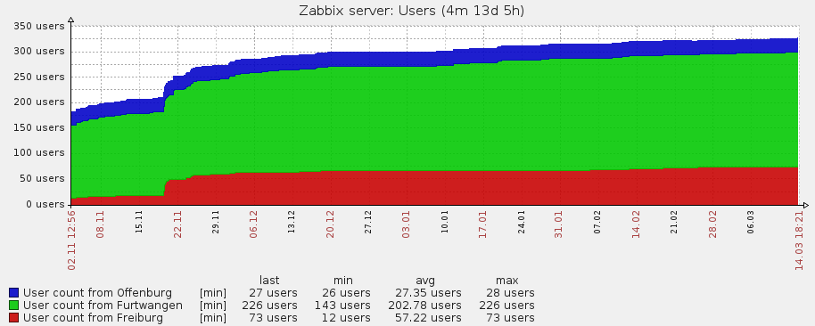

\newpage

Überblick
=========

Für mein Praxissemester war ich im Lehrpool/Rechenzentrum der Universität
Freiburg tätig. Während meiner Zeit dort war ich zuständig für die Wartung und
weiterentwicklung dreier Openstack Installationen.

Die erste war die Studicloud, diese wird in Zusammenarbeit mit der Hochschule
Furtwangen University benutzt.  Die zweite Installation ist eine Installation
namens BwCloud, die ein ähnliches Ziel wie die Studicloud besitzt aber über ganz
Baden-Württemberg verteilt ist, in diesem Fall waren wir für den Standpunkt
Freiburg zuständig. Die dritte Installation war die interne Installation,
genannt RzCloud.

Ich habe dieses Praxissemester zusammen mit Manuel Johannes Messner gemacht da
wir beide angenommen wurden durch unsere vorhergehenden Erfahrungen bezueglich
Openstack. Wir hatten oft die Aufgaben gemeinsam bekommen, und auch
abgearbeitet. Wir wurden auf die Universität Freiburg aufmerksam da wir beide
durch die Studicloud, im Rahmen unserer Arbeit als HiWi, dort Kontakte hatten.

Openstack
=========

Unser Praxissemester drehte sich hauptsächlich um Openstack. Openstack ist eine
Gruppe an Software Packeten um eine Server Cloud zu betreiben. Dieses besteht aus
mehreren unabhängigen Teilen die jeweils einen Teil machen; zum Beispiel Nova
für die Steuerung der Virtuellen Maschinen, oder Neutron für virtuelles Netze.

Während meiner Zeit habe ich mit allen, von Openstack bereitgestellten, _Core_
Packeten zusammengearbeitet:

- Keystone, Steuerung der Nutzer und Gruppen
- Nova, Bereitstellung und Steuerung Virtueller Maschinen
- Neutron, Vernetzung sowie Steurung dieser Netze
- Glance, Speicher der Virtuellen Abbilder
- Horizon, Dashboard für eine einfache Verwaltung

Es gibt noch weitere Module, da ich aber mit diesen nur wenig Kontakt hatte
wurden diese ausgelassen.

Entwickelt wird dieses Projekt seit 2010 unter anderem von der NASA
mitentwickelt.

Studicloud
----------

Die Studicloud ist eine Openstack Installation betrieben in Furtwangen. Dort
können sich Studenten aus Freiburg, Offenburg, sowie Furtwangen, Virtuelle
Server (auch VPS genannt) erstellen und verwalten. Jeder Student kann dann im
Rahmen seiner verfügbaren Ressourcen so viele Server starten wie er möchte/kann.

Die Installation ist seit September 2015 im Betrieb. Wir waren demnach von
Anfang an dabei und haben auch Aktiv die Weiterentwicklung gesteuert.

Die Cloud ist auf 5 Servern aufgebaut, 2 Management Knoten und 3 Compute
Knoten.

- Auf den Management Knoten liegen jeweils das Dashboard, Keystone sowie Neutron
- Auf den Compute Knoten gibt es auf jedem Nova sowie Virtuelle Router (durch
  Neutron gesteuert)

RzCloud
-------

Die RzCloud ist eine Test-Installation und wurde von uns auch so benutzt. Dort
konnten wir ungestört Infrastruktur testen, sowie verschiedene Wartungsabläufe
*üben* bevor wir diese dann Produktiv angesetzt haben. Sie hat einen ähnlichen
Aufbau wie die Studicloud.

BwCloud
-------

Die BwCloud ist komplexer aufgebaut wie die vorher gennanten da diese verteilt
ist. Sie besteht aus mehreren Zonen, verteilt durch Baden-Wuerttemberg.

Es gibt Standorte in Freiburg, Ulm, Mannheim sowie in Karlsruhe. Ich habe mich
während meines Praxissemesters nur mit dem Standort Freiburg auseinandergesetzt.

Der interne Aufbau ist der selbe wie in der Studicloud[\ref{studicloud}].

High Performance Computing
==========================

Freiburg besitzt auch einen HPC Cluster der viel in der Wissenschaft benutzt
wird; zum Beispiel für Simulationen.

Wir hatten nicht sehr viel mit diesem Cluster zu tun, durften uns aber ansehen
wie ein solcher Cluster aufgebaut ist, was sehr interessant und lehrreich war.

Erster Monat
============

Am Anfang wurden uns zwei Aufgaben gegeben:

- Monitoring für die Studicloud
- Auto Update von VPS Bildern

Monitoring
----------

Nach evaluation verschiedener Monitoring Software hatten wir uns für Zabbix
entschieden. Es ist darauf ausgelegt von mehreren Servern gleichzeitig Daten zu
sammeln, diese zu aggregieren und auszuwerten.

### Zabbix

Zabbix ist ein Monitoring Tool entwickelt für grosse Installationen an
verschiedenen, zu überwachenden Systemen. Eine typische Installation hat einen
Server der periodisch die einezelnen zu überwachenden Systeme abfragt und diese
Daten in eine Datenbank einpflegt. Es ist dann möglich gewisse Werte zu
überwachen und 'Triggers' auszulösen, bei z.B. zu wenig Speicher auf der
Festplatte. Die Erweiterbarkeit von Zabbix kam uns sehr gelegen und wir hatten
im Laufe des Semesters viele Skripte geschrieben die es einem ermöglichten eine
Openstack Installation gut im Auge zu behalten.

Monitoring (cont.)
------------------

Zabbix wurde dann im laufe der nächsten Tage auf den verschiedenen Maschinen
installiert und konfiguriert. Dies passierte auf der Studicloud, RzCloud sowie
auf dem HPC. Durch die E-Mails die durch 'Triggers' ausgelöst wurden hatten wir
immer die Situation schnell wieder under Kontrolle.

Putty und Windows
-----------------

Da viele Nutzer der Studicloud Windows benutzen war leider ein einbinden einer
spezifischen Anleitung für SSH nicht ausgeschlossen. Dies passiert unter Windows
oft unter Putty. Da dies aber keine OpenSSH Schluessel annimmt wurde uns die
Aufgabe gegeben ez zu ermöglichen, da Putty ein Tool bereit stellt mit dem
OpenSSH Schlüssel zu den Putty eigenen umwandeln kann.

Die Nutzung ist aber sehr archaisch und daher einem *gewöhnlichem* Windows User
nicht zumutbar, wir hatten uns daraufhin auf ein Windows Skript vereinbart. Da
wir sonst nicht Windows benutzen war dies etwas komplett neues für uns. Am
anfang hatten wir es mit einfachen Batch Dateien zusammen gebaut. Da Windows
sich aber in den letzten Versionen weigert Batch Dateien die aus dem Internet
kommen auszuführen konnten wir diese Methode nicht benutzen.

Die nächste Version wurde dann in PowerShell geschrieben, was einen erheblichen
Sprung nach vorne in der Technologie ist, aber leider immer noch vieles zu
Wünschen übrig lässt. Da PowerShell gewisse ähnlichkeiten zu C# hat fiel uns es
einfacher hier ein schlankes und funktionierendes Skript zu schreiben. Dies
wurde dann auch Produktiv eingesetzt.

Zweiter Monat
=============

Im Zweiten Monat hatten wir uns eingearbeitet und uns wurde mehr Freiheit
gegeben. Unsere Aufgaben wurden weniger Precise hatten dadurch aber mehr Umfang.
Es war eine Erfrischende Art zu arbeiten, wenn auch unbekannt.

Ceph
----

Wir haben uns dann ausgesucht Ceph näher kennen zu lernen damit wir es korrekt
überwachen können.

